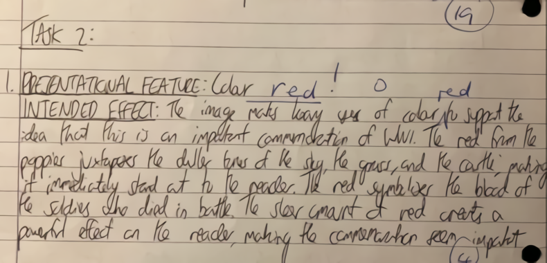

# Waifu2x-Based Image Upscaling and Morphological Preprocessing Pipeline

This repository presents a **GPU-accelerated image upscaling and preprocessing workflow** built on top of **Waifu2x (NCNN + Vulkan)** and **classical morphological image processing** (dilation and erosion).

The project contains **two complementary Python pipelines**:

1. **Pure Waifu2x Upscaling**
2. **Dilate → Waifu2x → Erode Preprocessing Pipeline**

Both pipelines are designed to be:
- Reproducible
- GPU-accelerated
- Research- and industry-ready
- Easy to understand and extend

---

## 📁 Repository Structure

.
├── image_preprocessing.py
├── only_upscaling_with_waifu2x.py
├── waifu2x_ncnn/
│   └── (waifu2x NCNN Vulkan Python bindings and models)
├── data/
│   ├── input-image.png
│   ├── input-image-dilate1.png
│   ├── input-image-waifu2x.png
│   ├── input-image-dilate1-waifu2x.png
│   └── input-image-dilate1-waifu2x-erode2.png
└── README.md

---

## 🛠️ Installation & Setup

This project is intentionally designed to be **minimal and easy to set up**.

### ✅ Python Version
- **Python 3.10** is required  
  (Recommended due to binary compatibility and stability)

> ⚠️ Using other Python versions may cause incompatibility issues,  
> especially with precompiled native extensions.

---

### 📦 Required Python Packages

Only the following packages are required:

```bash
pip install pillow==12.0.0 opencv-python==4.11.0.86 numpy==2.0.2
```

---

## 🚀 Waifu2x Backend (Important Notes)

That’s all — **no additional deep learning frameworks are required**.

### 📦 Local Waifu2x Backend

There is **NO requirement** to install `waifu2x-ncnn-vulkan-python` via `pip`.

The **Waifu2x NCNN Vulkan backend is already included in this repository**
as a local directory: waifu2x_ncnn/

All scripts in this project **directly import and use this local backend**.
This design choice provides several important advantages:

- No external wheel installation is required
- No CUDA dependency
- No TensorFlow dependency
- No PyTorch dependency
- GPU acceleration is handled entirely via Vulkan (if supported by your system)

---

## 🖥️ GPU Support

- Works on **Intel, AMD, and NVIDIA GPUs**
- Uses the **Vulkan API** for hardware acceleration
- Automatically falls back to **CPU mode** if no compatible GPU is detected

> ⚠️ **Important:**  
> Make sure your GPU drivers are up to date to ensure proper Vulkan support.

This backend architecture ensures **maximum portability**, **minimal dependencies**,
and **consistent performance across platforms**, making it ideal for
research, industrial pipelines, and long-term maintenance.

---

## 🚀 Technologies Used

- **Waifu2x (NCNN + Vulkan backend)**
  - GPU acceleration without CUDA, TensorFlow, or PyTorch
  - Works on NVIDIA, AMD, and Intel GPUs
- **OpenCV**
  - Morphological image processing (dilation & erosion)
- **Pillow (PIL)**
  - Image loading and saving
- **NumPy**
  - Kernel definitions for morphology

---

## 🧠 Motivation

In many computer vision and industrial imaging tasks, **simple upscaling alone is not enough**.

This project explores the idea that:
> *Applying light morphological preprocessing before and after super-resolution can improve structural continuity and edge stability.*

Therefore, we provide:
- A **baseline upscaling pipeline**
- An **enhanced preprocessing pipeline** combining classical morphology with modern super-resolution

---

## 1️⃣ only_upscaling_with_waifu2x.py

### Description
This script performs **pure image upscaling and denoising** using Waifu2x with GPU acceleration via Vulkan.

### Processing Steps
Input Image  
→ Waifu2x (2× Upscale, Noise Reduction)  
→ Output Image

### Key Parameters
- **Scale:** 2×
- **Noise Level:** 3
- **Backend:** Vulkan GPU
- **Tile Size:** 200 (safe for low VRAM GPUs)
- **Threads:** 2

### Example Result
**Input Image**


**Waifu2x Upscaled Image**


---

## 2️⃣ image_preprocessing.py (Dilate → Waifu2x → Erode)

### Description
This script implements a **three-stage preprocessing pipeline** combining classical morphology with GPU-based super-resolution.

The goal is to:
- Slightly expand thin structures before upscaling
- Perform high-quality resolution enhancement
- Refine boundaries after upscaling

### Processing Pipeline
Input Image  
→ Dilation (1×1 kernel, 1 iteration)  
→ Waifu2x Upscaling (2×, Noise=3)  
→ Erosion (2×2 kernel, 1 iteration)  
→ Final Output Image

### Morphological Parameters (Fixed)
These parameters are intentionally **not modified** to ensure reproducibility:
- **Dilation**
  - Kernel: (1 × 1)
  - Iterations: 1
- **Erosion**
  - Kernel: (2 × 2)
  - Iterations: 1

---

## 🖼️ Step-by-Step Visual Results

### 1. Original Input


---

### 2. After Dilation


---

### 3. After Waifu2x Upscaling


---

### 4. Final Result (After Erosion)


---

## ⏱️ Performance Measurement

Both scripts measure **pure Waifu2x inference time** using high-resolution timers:
- Time is reported in **milliseconds (ms)**
- Image loading and saving are excluded
- Suitable for benchmarking CPU vs GPU performance

---

## ✅ Key Advantages of This Approach

- **GPU acceleration without CUDA**
- **Deterministic preprocessing**
- **Modular and extensible design**
- **Compatible with research and industrial pipelines**
- **Clean and well-documented Python code**

---

## 📌 Use Cases

- Industrial vision preprocessing
- Dataset enhancement before training
- Edge-sensitive super-resolution tasks
- Academic research and benchmarking
- Robotics and inspection systems

---

## ⚠️ Notes

- Python version must match the installed waifu2x-ncnn Vulkan wheel (e.g. Python 3.9 or 3.10)
- Vulkan-compatible GPU drivers must be installed
- The repository assumes grayscale morphology but RGB super-resolution

---

## 📄 License

This project is intended for **research and educational purposes**.
Please check the licenses of:
- Waifu2x
- NCNN
- OpenCV
before commercial usage.

---

## 👤 Author

**Furkan Karakaya** GitHub: [F-Karakaya](https://github.com/F-Karakaya)

---

## ⭐ Final Note

This repository demonstrates how **classical image processing techniques** can be effectively combined with **modern GPU-accelerated super-resolution** to build robust and practical image enhancement pipelines.

Contributions and extensions are welcome.